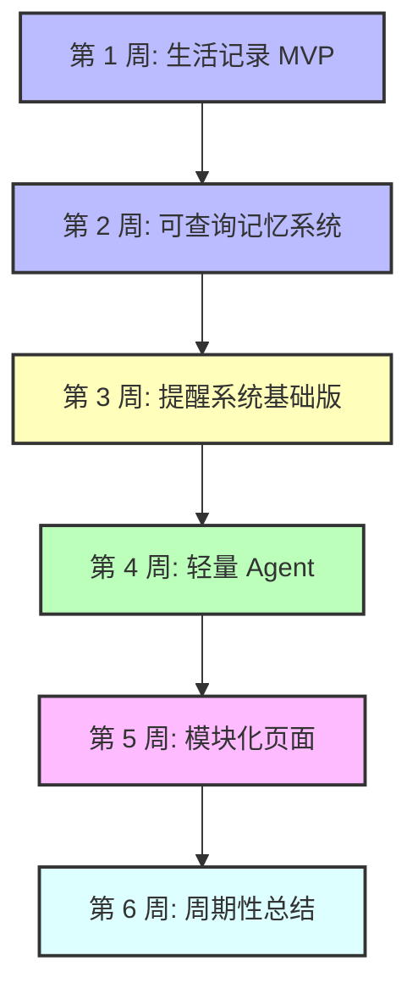
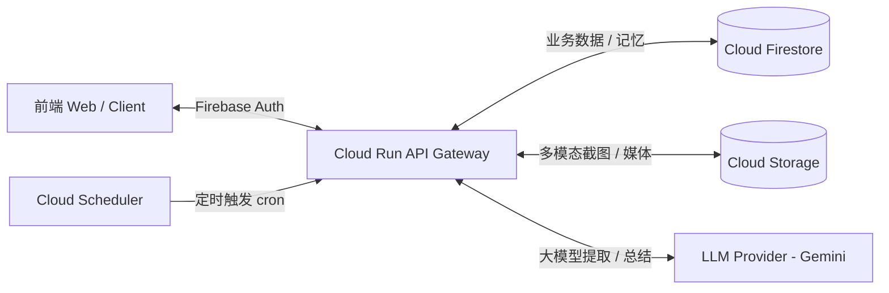

# 个人生活 Agent：LifeOS 核心路线图与设计初稿

> [!NOTE]
> 本文档定义了 **LifeOS**（个人生活记录、分析、提醒系统）的核心演进方向与技术架构初稿。
> 我们坚持 **“先做有用的，再做像 Agent 的”** 原则，通过精简的 Event 类型与强版本的 Schema 设计，保障系统在落地过程中的稳定。

---

## 🗺️ 演进路线图 (6周迭代计划)

我们重新调整了阶段划分，将“普通提醒”与“Agent 主动决策的提醒”进行了清晰的分离：



### 🗓️ 6周详细里程碑

| 周次 | 迭代目标 | 交付物 / 核心验收标准 |
| :--- | :--- | :--- |
| **第 1 周** | **阶段 1：生活记录 MVP** | 输入一句话 ➡️ LLM 自动结构化分类与提取 ➡️ 存入 Firestore。验收 3 个核心 API。 |
| **第 2 周** | **阶段 2：可查询记忆系统** | 自然语言提问 ➡️ 后端将意图解析为结构化查询条件 ➡️ 捞取数据并由 LLM 总结回答。 |
| **第 3 周** | **阶段 3：提醒系统基础版** | 传统意义上的提醒事项增删改查、过期状态维护。此阶段尚不引入 Agent，只追求业务闭环。 |
| **第 4 周** | **阶段 4：轻量 Agent 闭环** | 引入 Agent Loop（最多循环 5 次），自主识别并组合工具（例如：“今天猫咪呕吐了，明天提醒我观察”，自动调用 Ingest 和 CreateReminder）。 |
| **第 5 周** | **阶段 5：模块化 Dashboard** | 骑行页、猫咪页、家庭页、人生记录页的数据展示与可视化。多模态骑行截图识别录入。 |
| **第 6 周** | **阶段 6：情绪价值：月总结** | 捞取月度高重要性事件与指标趋势，生成自动分析周报/月报/年报。 |

---

## 🏛️ 整体技术架构 (Architecture)



### 🔒 身份验证
前端通过 Firebase Auth 获取 ID Token。后端在 Middleware 拦截并校验 Token，通过 Firebase Admin SDK 获取 `userId`（多用户隔离唯一 Key）。
```csharp
var decodedToken = await FirebaseAuth.DefaultInstance.VerifyIdTokenAsync(idToken);
var userId = decodedToken.Uid;
```

## 🧩 核心深度设计方案

### 1. 结构化数据 Schema 版本化与核心模型设计
为防止大模型输出 JSON 字段随迭代发生键名漂移，我们在 `LifeEvent` 中引入 `SchemaVersion`（默认 `v1`）。同时引入 4 个核心字段以实现高容错、易调试：
* **核心数据模型 (LifeEvent POCO)**：
  ```csharp
  public class LifeEvent
  {
      public string Id { get; set; }                  // 系统生成 (UUID / Firestore Id)
      public string UserId { get; set; }              // 系统生成 (多用户隔离 Key)
      public string Type { get; set; }                // cycling | home | cat | life | unknown
      public string SchemaVersion { get; set; } = "v1";

      public string Title { get; set; }               // 大模型生成
      public string Content { get; set; }             // 用户原始输入内容
      public DateTime OccurredAt { get; set; }        // 默认为记录时间 (UTC)
      public string TimeZone { get; set; }            // 用户录入时的本地时区 (如 "Asia/Tokyo")
      public List<string> Tags { get; set; } = new(); // 大模型提取

      public int Importance { get; set; }             // 重要程度 1-5 (大模型判断)
      public string Source { get; set; } = "manual";  // 系统决定 (manual | agent)

      // LLM 提取的纯业务字段
      public Dictionary<string, object> StructuredData { get; set; } = new();

      // 智能体执行与调试辅助字段
      public double ExtractionConfidence { get; set; } // LLM 提取置信度 (0.0 - 1.0)
      public bool NeedsReview { get; set; }            // 是否需要人工确认 (如解析失败或置信度过低)
      public string? RawLlmOutput { get; set; }        // 调试用：记录原始大模型输出的 JSON 文本 (生产环境可选)
      public DateTime CreatedAt { get; set; } = DateTime.UtcNow; // 系统生成 (UTC)
  }
  ```

* **⚠️ 字段边界原则**：
  * **LLM 只能生成业务内容**（如 `type`, `title`, `tags`, `importance`, `structuredData` 等）。
  * **LLM 绝对不能决定系统元数据**（如 `id`, `userId`, `source`, `createdAt` 等）。这些字段必须由后端服务器在持久化时自行填充，防止恶意提示词（Prompt Injection）越权修改或注入脏数据。

### 2. 多轮对话的“指代消解”与上下文支持（第 2 周 / P1 之后）

> [!NOTE]
> **阶段 1 不实现该能力**，仅作为后续阶段设计目标保留。
> 后续阶段进行 Ingest 请求时，后端将带上该会话的最近几条历史消息。大模型提取信息时，结合上下文判断“它今天精神还好”中的“它”是指代上一条记录里的“黑猫”。

### 3. 会话（Chat Sessions）与记忆分离
* **Chat Sessions Collection**：记录即时沟通的上下文流，属于“工作内存”，随时间清理或归档，不污染核心数据库。
* **Life Events Collection**：经过结构化提取并确认的长期事实，属于“长期记忆”。

---

## 📂 项目结构规划 (LifeAgent.Api)

```text
LifeAgent.Api
├─ Controllers
│  ├─ LifeController.cs          // Ingest 与 Query
│  ├─ ReminderController.cs      // 提醒事项 API
│  └─ AgentController.cs         // 触发 DailyCheck 等 Agent API
├─ Services
│  ├─ LlmService.cs              // 模型分类与结构化提取、总结
│  ├─ LifeEventService.cs        // Firestore 核心事件存储与读取
│  ├─ ReminderService.cs         // 提醒逻辑
│  └─ AgentRunner.cs             // Agent Loop 执行环
├─ Tools
│  ├─ SaveLifeEventTool.cs
│  ├─ SearchLifeEventsTool.cs
│  ├─ CreateReminderTool.cs
│  └─ ListRemindersTool.cs
├─ Models
│  ├─ LifeEvent.cs
│  ├─ Reminder.cs
│  ├─ ChatSession.cs
│  └─ AgentRun.cs
└─ Middleware
   └─ FirebaseAuthMiddleware.cs
```
