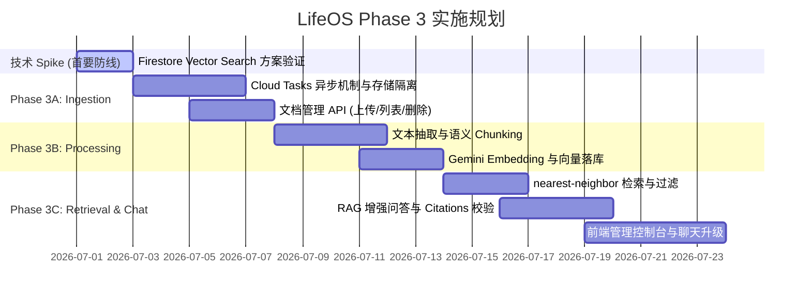

# LifeOS Phase 3 核心路线图 (Roadmap)

## 一、 Phase 3 总体目标

**Phase 3 的核心定位是构建 LifeOS 的“知识接入层” (Knowledge Ingestion Layer)**。
我们专注于提供**用户个人资料的安全摄入、文本抽取、语义分块、向量化索引，以及高准确率、可追溯来源的 RAG 检索问答能力**。通过打通“非结构化文档 -> 768维向量 -> 相似度检索 -> 带引用的生成问答”的数据流，为后续长期记忆、工具自主调用和复杂工作流奠定数据底座。

### 工程化基本原则：
- **适合 Phase 3 MVP 阶段**：系统采用“GCS 存储 + Firestore 向量检索 + Gemini API”的核心架构，避免引入重型外部向量库，满足单租户万级 chunk 规模下的快速迭代。
- **稳定性保证**：异步处理明确依赖 GCP Cloud Tasks 做任务调度投递，禁止在 Cloud Run 中使用 fire-and-forget `Task.Run`。
- **技术 Spike 前置**：正式开发前必须先通过 Firestore Vector Search 技术预研验证，排除基础库兼容性隐患。

---

## 二、 阶段划分与里程碑 (Milestones)

Phase 3 建设可被严密拆分为三个迭代：

### 🎯 Phase 3A：基础 Ingestion (文档摄入)
**交付目标**：实现个人文件的安全上传与异步任务分发机制。
- **存储与隔离**：建立与 Cloud Run 区域一致的 GCS Bucket，利用 `users/{userId}/...` 强制隔离，保护用户隐私。
- **任务分发机制**：通过 Google Cloud Tasks 投递异步解析任务。上传接口只负责鉴权、写 GCS、写入元数据状态并触发 Task，严禁依赖 `Task.Run` 后台线程。
- **元数据基础 API**：支持文档物理与逻辑删除，当 chunks 较多时，引入异步批量清理。

### 🎯 Phase 3B：Processing & Vectorization (解析与向量化)
**交付目标**：打通文本抽取和 768 维向量落库。
- **文本提取**：采用 `PdfPig` 等开源模块，抽离出 PDF、TXT、MD 中的纯文本内容。
- **分块策略 (Chunking)**：采用“语义段落优先 + 字符近似 + 10% overlap”合并规则。
- **向量化**：强制使用 `gemini-embedding-001` 并在请求中显式设置 `outputDimensionality = 768`。

### 🎯 Phase 3C：Retrieval & Chat (检索与增强对话)
**交付目标**：实现与现有会话历史对接的、具备引用质量控制的高置信问答。
- **会话衔接**：RAG 聊天接口入参加入 `conversationId` 和可选的 `documentIds`（限定检索范围），后端负责从数据库提取最近 N 条历史消息，不依赖前端直传 history；问答结果自动落入现有的 conversation messages 集合。
- **检索与阈值控制**：执行 nearest-neighbor 检索，引入距离阈值（Distance Threshold）物理过滤噪声 chunks，防止低相关干扰。
- **引用质量控制**：后端根据模型提取的方括号标记和 retrievedChunks 结果物理拼装 `citations`，并在 Response 中返回 `citationIntegrity` 引用完整度状态，对越界幻觉进行清洗。

---

## 三、 与 Phase 1 & Phase 2 衔接与审计

### 1. 鉴权与物理路径隔离
- **衔接**：继承 Phase 1 已经建立的 Firebase Auth 鉴权拦截。所有新增实体物理上隔离于 `users/{uid}/documents`、`users/{uid}/chunks` 以及 GCS 的 `users/{uid}/...` 路径下，防止多租户越权。

### 2. 时区 (clientTimeZone) 语义说明
- **澄清与对齐**：`clientTimeZone` 在 Phase 3 中 **仅用于解释和对齐用户提问中的相对时间词（如“今天”、“明天”、“上周”）**。
- **核心规避**：**严禁将 chunk.createdAt（上传物理时间）等同为文档正文记述的时间。如果文档正文中有明确的日期记述，模型必须优先依据文档正文的文字内容记述的时间**。

### 3. 会话数据的完全衔接
- **衔接**：Phase 3 的 RAG 聊天将复用现有的会话记录和消息数据模型，生成的 RAG Answer 作为新的一条 Message 存入对应的 `messages` 集合，从而保证对话界面的时间轴连续，支持多轮追问。

---

## 四、 阶段验收指标 (SLA KPIs)

### 1. 检索与问答时延分布 (SLA)
- **P50 响应时间**：< 3 秒（检索、组装、Gemini 2.5 Flash 生成及引用校验完成）。
- **P95 响应时间**：< 8 秒（排除偶尔的模型冷启动或网络抖动）。
- 具体指标应以生产线上日志和持续集成压力测试为准。

### 2. 异步处理时效
- **小文件 (< 1MB)**：Cloud Tasks 异步消费并在 15 秒内处理（解析+向量落库）完毕。
- **中等文件 (1MB ~ 5MB)**：在 45 秒内处理完毕。
- **大文件 (5MB ~ 10MB)**：在 90 秒内处理完毕。
