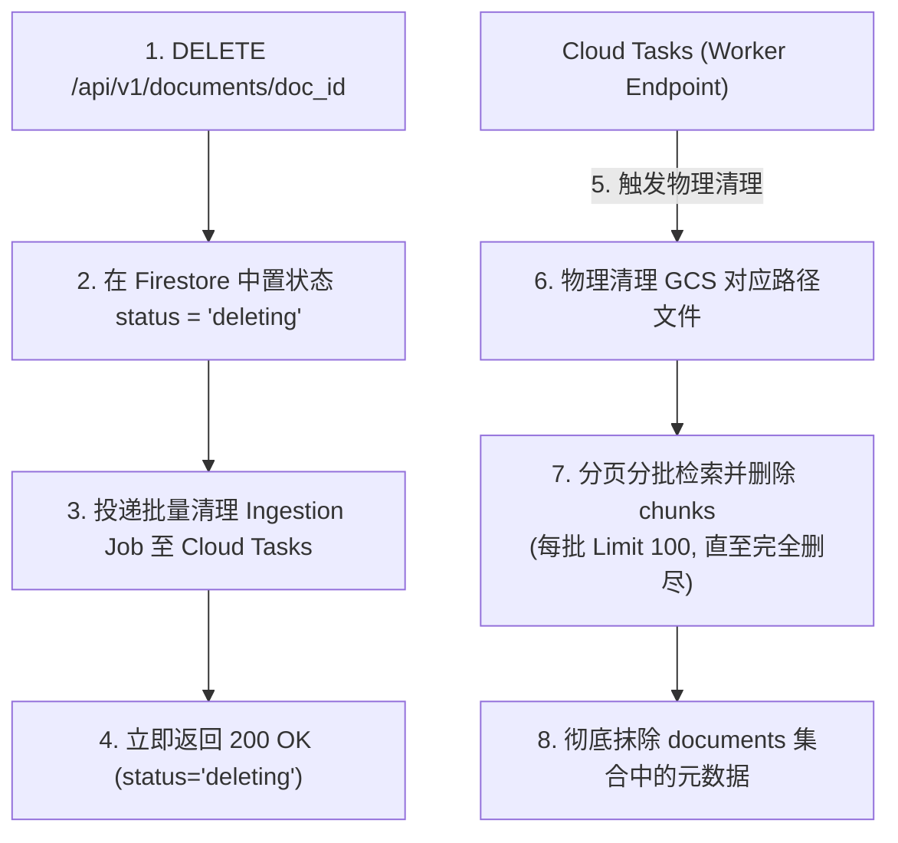

# Phase 3 Google Cloud Storage 存储设计 (Storage Design)

## 一、 Bucket 规范与物理区域一致性

为了保证个人资产的存储安全与隔离，系统采用 **Google Cloud Storage (GCS)** 作为非结构化文档的中转与存储中心。

### 1. Bucket 命名规范
- **开发/测试环境**: `lifeos-user-knowledge-dev`
- **生产环境**: `lifeos-user-knowledge-prod`
- **存储类别**: `Standard` （因为 RAG 系统的文件需要低延迟、经常性的读取解析）

### 2. 物理区域一致性原则 (Region Alignment)
- **非硬编码约束**：**本设计不硬编码任何具体区域（如 `asia-east1`）**。
- **区域匹配规则**：GCS Bucket 所在的地理区域（Region）**必须与 Cloud Run (API 托管实例) 以及 Firestore 所在的 GCP 区域保持高度一致**。
- **示例路径**：如果当前项目核心部署在 `us-central1`，则 dev/prod bucket 必须优先选定在 `us-central1`，以最小化内网带宽延迟并避免跨区域数据传输产生的跨区频宽资费。

---

## 二、 用户隔离路径规范

系统采用强多租户物理路径前缀进行隔离。所有文件存取均由后端 BFF（Web API）转发和权限拦截。

```
gs://{bucket_name}/users/{userId}/documents/{documentId}/{filename}
```

### 路径变量定义：
- `{bucket_name}`：当前环境部署的 GCS Bucket。
- `users/`：用户根级目录。
- `{userId}`：用户的 Firebase Auth UID（严格提取自 JWT Bearer 认证，严禁由客户端参数指定，防范越权）。
- `documents/`：文档知识库目录。
- `{documentId}`：在 Firestore 产生的文档 UUID（如 `doc_8f7b2c9d1e4a3`）。
- `{filename}`：用户上传时的原始文件名。为避免字符转义导致的路径异常，后端在存储时对文件名做 URL Encode。

---

## 三、 支持的文件类型与限制

在 Phase 3 MVP 阶段，系统对摄入文件的类型和体积实施严格控制，以兼顾安全性、稳定性和开发成本。

| 参数指标 | MVP 设定标准 | 后续升级说明 |
| :--- | :--- | :--- |
| **支持的 MIME 类型** | 1. `application/pdf` (标准文本PDF)<br>2. `text/plain` (.txt)<br>3. `text/markdown` (.md) | `.docx` (Office Word)<br>`.html` (网页保存) |
| **单文件最大限制** | **10 MB** | 针对高阶会员扩大至 50MB |
| **单用户文件总上限** | 暂定 **100 个文件**（物理拦截，防止滥用） | 弹性动态配额 |
| **加密与格式保护** | 严禁上传带有密码保护的 PDF 文件。若上传，后端解析组件将捕获 `EncryptionException`，直接置文档状态为 `failed` | 支持用户输入文档密码进行在线解密并解析 |

---

## 四、 访问权限与安全控制 (Security & IAM)

1. **零前端直连原则 (Zero Client-to-GCS Direct Access)**：
   - 所有的文件上传、状态追踪、文件删除均**通过 BFF API（Cloud Run 后端）**进行中转。
   - 绝不采用前端预签名 URL 的直传方案。虽然直传省流量，但 BFF 中转有助于在后端进行流量控制、文件安全扫描、实时格式验证，并且完全防止 GCS 的 Key 泄露。

2. **最窄权限服务账户 (Least Privilege Service Account)**：
   - Cloud Run 运行绑定的服务账户，仅授予其对该 Ingestion Bucket 的 `roles/storage.objectAdmin` 角色（支持写入、读取、删除），而不具备修改 Bucket 级 IAM 策略的超纲管理员权限。

---

## 五、 异步级联删除机制 (Cascading Delete)

由于文件产生了大量的 Chunks 向量记录（可能超过 500 次单次 Batch 限制），为了防止 API 响应超时导致逻辑悬挂，删除流程设计为**异步标记分批清理机制**：



1. **状态标记**：后端将 Firestore 中 document 状态变更为 `deleting`（前端列表自动置灰或过滤），表示逻辑删除。
2. **异步队列投递**：向 Google Cloud Tasks 投递清理作业。
3. **物理清理与分批 Chunks 删除**：
   - 后台 Worker 进程先删除 GCS 对应的物理对象。
   - 随后，由于可能存在成百上千条 Chunk，后端采用分页检索形式（例如每次 Limit 100 检索），分多批次删除 `chunks`，单次批处理不超过 Firestore 500 次写入上限。
   - 实际删除的 `deletedChunksCount` 由 Worker 在执行完毕后进行日志和指标统计更新。
4. **元数据抹除**：完全删除 `chunks` 后，最后在数据库彻底抹除 `documents` 元数据文档。
