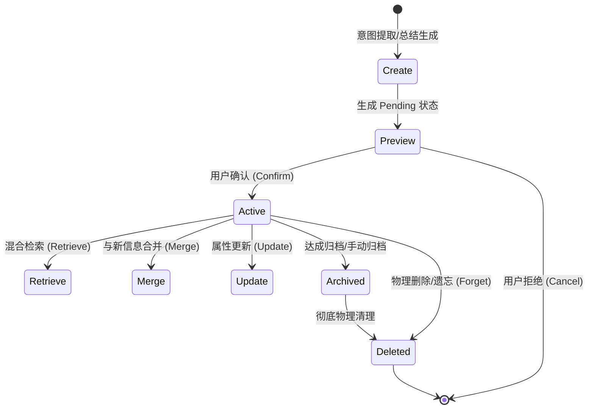

# Phase 6.0 Memory Engine 架构设计

> 创建日期：2026-06-30
>
> 当前前置状态：Phase 3 RAG、Phase 4 Agent Preview 与 Phase 5 Agent Write MVP 的开发阶段均已正式完成。Release Gate 目前处于 No-Go 状态，真实写入 canary 尚未在线上真正执行。
>
> 本文目标：定义并冻结 Phase 6.0 长期记忆引擎（Memory Engine）的核心架构、概念模型、生命周期及多组件协作策略。
>
> **声明：本文件属于纯架构设计文档，不涉及任何代码实现、不进行线上部署、不修改数据库物理 Schema、不调整 Cloud Run 环境变量与 Firestore 安全规则。**

---

## 1. Phase 6 最终目标

### 1.1 Memory Engine 的核心目标
Memory Engine（长期记忆引擎）旨在为 LifeOS 系统注入**状态连续性**和**个性化认知能力**。此前，系统只能处理孤立的瞬时事件（Timeline）或基于外部文档进行知识问答（RAG），每次对话都需要用户重复解释背景背景。
通过 Memory Engine，系统将能够：
- 从日常行为、总结 and 人际对话中，**自动提炼并沉淀**用户的习惯、长期目标、偏好、以及人际关系。
- 在用户知情并明确确认的边界内，实现长期记忆实体的增量更新、合并与物理遗忘。
- 在 Agent 决策（Planner）和回答生成（Response）阶段，**自动召回并注入**高度相关的长期记忆，实现无缝的个性化体验。

### 1.2 为什么 Phase 6 是 LifeOS 的核心阶段
- **由“被动”向“主动”的质变跃迁**：没有长期记忆，AI 只是一个被动的 RAG 问答框；拥有了记忆，AI 才能真正理解用户的“生活上下文”，在 Planner 中围绕用户长期目标生成主动建议与例行提醒。
- **构建个人数字孪生（Digital Twin）的基础**：它是后续“周复盘 Agent”、“主动生活助理”等高级自治场景的核心燃料。
- **确立以用户为中心的安全隐私防线**：在架构级确立记忆的可见性、审计性及“可被物理遗忘”的权利。

---

## 2. 当前系统基线

在启动 Phase 6 规划时，项目的技术与功能基线已固定如下：

1. **Phase 3 RAG (已完成)**：系统具备完整的 PDF 文档上传、异步向量化（768维 `text-embedding-004`）、带有引文二次校验（Citation Integrity）的 RAG 问答、以及基于会话的 RAG 对话历史持久化能力。
2. **Phase 4 Agent MVP (已完成)**：系统搭建了受控的 `AgentRunner`、只读工具集（如文档状态查询、RAG 向量检索）、用于用户确认的 pending action 确认状态机以及 `AgentPreview` 前端组件。
3. **Phase 5 Agent Write MVP (Development Complete)**：支持了第一个真实写入工具 `create_life_event` 的全套后端校验、幂等保障和 rollback 日志。但在生产环境下该功能默认通过 feature gate 保持关闭。
4. **Release Gate (No-Go)**：真实写入 canary（如 `RUN_AGENT_WRITE_SMOKE` 等环境变量）已被彻底隔离在此发布闸门后。目前该发布闸门处于未批准状态，线上未执行任何真实的 Agent 自动修改与数据写入。

---

## 3. Memory Engine 在 LifeOS 架构中的位置

长期记忆引擎位于系统核心决策循环的底层，连接 RAG、Timeline 和 Planner：

```mermaid
flowchart TD
    User([用户输入/每日总结触发]) --> AgentRunner[AgentRunner]
    subgraph MemoryEngine [Memory Engine (长期记忆引擎)]
        MemoryRetrieval[1. Memory Retrieval 召回]
        MemoryUpdater[2. Memory Updater 更新/合并]
        MemoryStore[(Firestore: memories)]
    end
    subgraph ExecutionFlow [核心决策流]
        Planner[Planner (提示词与意图分析)]
        ProposedAction[ProposedAction (提议动作)]
        Confirmation[Confirmation State Machine (待确认状态机)]
        Executor[Executor (工具执行)]
    end
    AgentRunner -->|发起 Run| MemoryRetrieval
    MemoryStore -->|召回相关记忆| MemoryRetrieval
    MemoryRetrieval -->|Context 注入| Planner
    Planner -->|生成| ProposedAction
    ProposedAction -->|写入类 Action| Confirmation
    Confirmation -->|用户确认/确认变更| Executor
    Executor -->|执行 save_memory 动作| MemoryUpdater
    MemoryUpdater -->|写入/覆盖/合并| MemoryStore
    Executor -->|写入原始数据| Timeline[(Firestore: life_events)]
    RAG[(Firestore: chunks)] -.->|客观知识源| Planner
    Timeline -.->|原始生活数据源| Planner
```

---

## 4. Memory 类型划分 (Memory Taxonomy)

为了确保长期记忆的结构化管理、隐私分级以及精准召回，我们将 Memory 划分为以下 12 种核心类型：

| 记忆类型 | 描述说明 | 召回优先级 | 保存期限 |
| :--- | :--- | :---: | :--- |
| **1. Life Event** | 个人生活中的重大/关键事件记录（非琐碎的 Timeline） | 中 | 永久 |
| **2. Preference** | 用户的个人偏好、生活习惯或品牌选择 | 高 | 长期（可被覆盖） |
| **3. Goal** | 用户的短期（月度）、中期（季度）、长期（年度）目标 | 高 | 阶段性（达成后归档） |
| **4. Habit** | 经系统分析自动归纳出的生活规律或周期性习惯 | 中 | 长期 |
| **5. Relationship** | 用户的人际关系网、重要联系人背景及交互忌讳 | 高 | 长期 |
| **6. Knowledge** | 个人总结出的高价值方法论或私有长效知识 | 中 | 长期 |
| **7. Project** | 正在进行的个人任务或重要事务周期（如“备考”、“装修”） | 高 | 临时至中期 |
| **8. Person** | 用户提到过的第三方人物画像（如“导师张教授”、“朋友小明”） | 中 | 长期 |
| **9. Location** | 用户的常用地点（如“公司地址”、“常去健身房”） | 低 | 长期 |
| **10. Routine** | 用户的常规日程模板（如“周五晚上家庭聚餐”） | 中 | 长期 |
| **11. Constraint** | 核心红线约束（如“花生过敏”、“不接受晚上 10 点后的提醒”） | 极高 | 永久（除非主动修改） |
| **12. Temporary Context** | 临时的短期关注点（如“本周在出差”、“明天需要早起”） | 极高 | 极短（数天内过期） |

---

## 5. 每种 Memory 类型说明

以下是 12 种 Memory 类型在系统运行中的具体特征矩阵：

| 记忆类型 | 定义 | 典型示例 | 是否必须用户确认 | 适合长期保存 | 是否有过期机制 | Agent 主动引用策略 |
| :--- | :--- | :--- | :---: | :---: | :---: | :--- |
| **Life Event** | 重大客观事实记录 | 2026-06-30 顺利完成 Phase 5 答辩 | 否 (只读/导入) | 是 | 否 | 用于回顾、时间线分析、重大纪念日提醒 |
| **Preference** | 主观的生活/习惯偏好 | 喝咖啡只加燕麦奶，不要糖 | 是 | 是 | 否 | 在 Planner 涉及外卖、点单、做计划时自动调用 |
| **Goal** | 个人核心诉求与目标 | 2026年完成执业医师资格证考试 | 是 | 是 | 目标达成或放弃后自动归档 | 自动生成每周计划和进度提示 |
| **Habit** | 被系统分析提炼的模式 | 每周二和周四晚上 8 点去健身房 | 是 (提议确认) | 是 | 否 | 在该时间段前提前提醒，或推荐健康饮食 |
| **Relationship** | 社交与人际网络属性 | 妻子对百合花过敏，生日是 10-12 | 是 | 是 | 否 | 在重要节点提前触发提醒和礼物方案建议 |
| **Knowledge** | 用户记录的长效方法论 | 遇到数据库死锁时的排查步骤文档 | 否 | 是 | 否 | 在用户发起相关技术咨询时直接召回作为上下文 |
| **Project** | 跨多天的复合任务体系 | 完成 life-agent 的 Phase 6.0 设计 | 否 | 否 | 完成后立即归档 | 每天总结时汇报该 Project 的进度与待办 |
| **Person** | 关系人肖像 | 导师张教授，喜好喝龙井茶 | 否 | 是 | 否 | 撰写邮件或准备会面时，自动提示该人物背景 |
| **Location** | 空间地理常去节点 | 朝阳区太阳宫南街甲1号（父母家） | 否 | 是 | 否 | 规划出行、日常通勤计划时提供建议 |
| **Routine** | 日常惯例与固定日程 | 每个工作日早晨 8:30 坐地铁通勤 | 否 | 是 | 否 | 在发生路线异常或延误时主动发出警报 |
| **Constraint** | **安全与红线约束限制** | 严重乳糖不耐受，禁用乳制品 | **是 (强制)** | 是 | 否 | **所有 proposedAction 在生成前必须经过此约束过滤校验** |
| **Temporary Context** | 临时的短期状态快照 | 本周正在上海出差，预计周五回京 | 否 | 否 | **是 (通常 1-7 天内)** | 临时覆盖日常 Routine，指导本周的活动建议 |

---

## 6. Memory 生命周期 (Memory Lifecycle)

每个记忆实体在系统内均遵循严密的生命周期管理，以确保存储的准确性与合规性：



1. **Create (创建)**：Agent 在分析 RAG 对话、Timeline 记录或每日总结时，发现有价值的记忆实体，触发 `save_memory` 提议。
2. **Preview (预览)**：产生一个 `pending_confirm` 状态的记忆实体，并在前端的 `AgentPreview` 面板展示待确认卡片。
3. **Confirm (确认)**：用户点击同意，记忆状态变更为 `active`，正式进入长期记忆库。若用户取消，则该 `pending` 动作直接作废，不写入物理记忆库。
4. **Store (存储)**：将记忆实体持久化至 Firestore 的 `memories` 集合中。同时进行文本分块，产生 768 维向量写入向量库，以便后续相似度召回。
5. **Retrieve (检索)**：在 AgentRunner 启动时，基于当前 Query 进行 Hybrid 检索，召回处于 `active` 状态的相关记忆。
6. **Merge (合并)**：当系统检测到新记忆与现有记忆内容重合度较高时（如“喜欢加糖咖啡”与“喜欢无糖拿铁”），触发合并逻辑，将旧记忆升级。
7. **Update (更新)**：对已有记忆的属性（如上次召回时间 `lastRecalledAt`、召回计数 `recCount` 等元数据）进行增量更新。
8. **Archive (归档)**：当 Goal（目标）达成，或 Project（项目）结束，记忆状态变更为 `archived`。归档记忆不再参与日常召回，但保留在数据库中用于年终复盘等深度回顾。
9. **Forget (物理遗忘/删除)**：根据用户的主动指令（“忘记我的住址”），或对于过期 Temporary Context 的清理机制，执行物理删除，同时抹除向量索引。

---

## 7. Memory 写入与审核策略

### 7.1 自动提议写入 (Auto-Proposal)
- **触发源**：系统分析 Timeline 上的原始 `life_events`、每日总结（Daily Summary）或 RAG 问答会话中的关键语句。
- **匹配规则**：当 LLM 检测到符合 12 种 Memory Taxonomy 中高价值记忆的特征（如“我最近开始...” “我总是...” “我以后不要...”）时，自动生成 `actionType = "save_memory"` 的 proposedAction。

### 7.2 必须用户确认的写入边界
为了防止 AI 基于幻觉或错误推理弄脏用户的记忆库，以下写入操作**必须经过用户显式确认**：
1. **Constraint（核心红线）的创建与修改**：涉及过敏源、健康限制、财务敏感词。
2. **Goal（长期目标）的生命周期变更**：如建立考证目标、放弃买房目标等。
3. **Preference（生活偏好）和 Habit（日常习惯）的新增**。
4. **对已有记忆的冲突性更新**：如果新信息彻底推翻了已确认的旧记忆。

### 7.3 绝不自动写入的红线
- 用户的任何登录凭证、系统密码、API 密钥、身份证号、银行卡号。
- 临时的情绪性抱怨（如“今天烦透了某某人”，这只应作为 raw event 记录在 Timeline，绝不能被提炼为 Relationship 记忆）。

### 7.4 与 Phase 5 create_life_event 的关系
* **定位不同**：
  * `create_life_event` 写入的是 **Raw Data (原始生活数据)**。它是一条离散的时间戳事件（如“下午 3 点喝了杯燕麦拿铁”），属于 Timeline。
  * `save_memory` 写入的是 **Cognitive Entity (认知实体)**。它是经过抽象和合并的长效认知（如“偏好：喜欢喝燕麦奶咖啡”），属于 Memory。
* **协作流**：
  1. 用户在 Timeline 记录了多次“下午去跑步”（多个 `life_events`）。
  2. Weekly Agent 运行，读取 Timeline 后发现用户经常在下午跑步。
  3. Agent 触发 `save_memory`，向用户提出一条 Habit 记忆提议：“您似乎习惯每周跑步，是否将‘跑步’保存为长期习惯偏好？”。
  4. 用户确认后，该 Habit 进入 Memory。

---

## 8. Memory 更新与合并策略 (Merge & Conflict)

由于记忆具有时效性且会不断变化，Memory Engine 必须能够解决记忆间的碰撞：

```
                    新传入的记忆实体 (Memory Proposal)
                                    │
                         ┌──────────┴──────────┐
                         ▼                     ▼
                  是否检测到相似实体？      是否存在冲突冲突？
                    (Vector Score > 0.8)     (例如: 新地址 vs 旧地址)
                         │                     │
               ┌─────────┴────────┐            ├──────────────────────┐
               ▼                  ▼            ▼                      ▼
            [Merge]            [Append]    [Resolve Conflict]      [Ignore]
         内容重合,进行      内容补充,增量   提示用户澄清,人工     无实质变化,
         合并覆盖 (无冲突)   列表追加记录    确认后再执行变更     直接忽略丢弃
```

### 8.1 更新操作类型
- **Append (追加)**：对已有关系或清单的补充。例如在 `Preference: 喜欢看的书` 列表中追加一本新书名。
- **Replace (替换)**：用新状态覆盖旧事实。例如更新 `Location: 租房地址`。
- **Merge (合并)**：对于相似但不冲突的内容进行整合，提升数据的紧凑度。

### 8.2 冲突检测机制 (Conflict Detection)
- 在写入 `pending_confirm` 之前，通过检索出的相似记忆进行 LLM 逻辑判断。如果新事实与已有事实矛盾（如：“目前正在减肥”与“偏好是每晚吃油炸食品”），系统标记此 ProposedAction 为 `hasConflict = true`。
- 前端在渲染该卡片时，会高亮显示冲突提示，并提供二选一或编辑文本的选项，确保用户的真实意图为唯一准则。

### 8.3 过期记忆处理 (Stale Memory Handling)
- 记忆实体包含 `recCount`（被召回次数）和 `lastRecalledAt`（上次召回时间）。
- 当某条非 Constraint 类型的记忆在长达数月内从未被召回，且其关联的 Project 或 Goal 已经过时，系统会在后台将其移动至 `archived` 状态，防止其污染 Planner 的 Context 空间。

---

## 9. Memory 检索策略 (Memory Retrieval)

检索系统的核心是：**在对的时间，以最低的 Token 成本，将最关键的记忆召回给 AI。**

### 9.1 四大召回时机
1. **Query-time Retrieval (提问阶段)**：用户提问时，提取实体并快速召回相关偏好。
2. **Planner-time Retrieval (决策阶段)**：在 Planner 构思需要调用哪些工具、安排什么待办时，召回用户的 Routine 和 Constraints 约束，保证生成的 ProposedAction 合理合规。
3. **Confirmation-time Retrieval (确认阶段)**：在用户确认 proposedAction 时，再次检索 Constraints，进行后置安全网复核。
4. **Response-time Recall (回复拼装阶段)**：拼装回答时，注入用户的人称偏好、语气喜好，使输出更贴心。

### 9.2 混合检索与排序算法 (Hybrid Search & Ranking)
系统使用 Firestore 向量索引进行语义搜索，同时辅以 Metadata 的精确过滤（如 `status == "active"`）。对于召回的候选记忆，其排序得分计算如下：

Score = w1 * Similarity + w2 * Recency + w3 * Importance

- **Similarity (语义相似度)**：向量检索的余弦相似度（Cosine Similarity）。
- **Recency (时效衰减)**：使用半衰期公式计算衰减度，其中分母随距今天数增加。对于 Temporary Context，快速衰减；对于 Constraint 和 Life Event，极慢衰减。
- **Importance (重要性评分)**：由用户在确认时物理赋予的权重（如 Constraint 默认具有最高权重）。

---

## 10. Memory 召回与引用策略 (Memory Recall)

AI 引用记忆时，必须建立**分寸感**，避免带来越界的过度拟人化（Creepy）感觉。

### 10.1 主动引用与回避边界
* **建议引用**：
  - “根据您对燕麦奶的偏好，我已为您生成了明天的点单建议。”
  - “本周您在出差，已自动将周二的线下健身提醒推迟。”
* **必须回避**：
  - 在回答通用的客观知识问题（如“1+1等于几”或“如何用 Python 写快速排序”）时，强行插入用户的个人记忆。
  - 无预警地提起用户已经很久未提及的创伤性或极端私密的 Raw 记录。

### 10.2 Creepy / Over-personal 预防机制
* **显式归因（Explicit Attribution）**：AI 在话术中如果使用了长期记忆，**必须明确向用户解释原因**，消除神秘感。
  * *正确话术*：“考虑到您在偏好中记录了您对百合花过敏，我将买花提醒的备选推荐改为了玫瑰。”
  * *错误话术*：“我知道你讨厌百合花，所以我建议你买玫瑰。”（这种话术会带来被暗中监视的不适感）。

---

## 11. 遗忘与隐私策略 (Forget & Privacy)

### 11.1 遗忘机制
- **用户主动删除**：系统必须在前端提供一个“长期记忆管理面板”（Memory Dashboard），用户可以对任何一条 active 或 archived 的记忆执行彻底物理删除（Hard Delete），不允许使用逻辑删除，确保数据所有权。
- **过期自动清理**：由后台定时任务清理 `Temporary Context` 中过期的记录。

### 11.2 敏感信息处理
- 所有处于 `pending_confirm` 的数据在序列化前，需经过敏感正则匹配（如常见卡号、密码模式）。
- 绝不在 Memory 向量索引库中对可能包含隐私明文的敏感分块建立 Embedding。

---

## 12. Timeline 与 Memory 的关系

- **Timeline 是“事实长河”**：由 `users/{userId}/life_events` 构成，记录“什么时候发生了什么事”（Raw events）。
- **Memory 是“认知沉淀”**：由 `users/{userId}/memories` 构成，记录“我是个什么样的人，我有什么规则”（Structured patterns）。
- **两者的联动回馈机制**：
  - **Timeline -> Memory**：通过 Weekly/Monthly Review Agent 分析 Timeline，提炼出 Habit 和 Preference 进入 Memory 库。
  - **Memory -> Timeline**：Agent 读取 Memory（如习惯和目标），为用户安排明日待办计划，用户在明日执行并打卡后，产生新的 `life_events` 写入 Timeline。

---

## 13. RAG 与 Memory 的关系

在 LifeOS 系统中，客观知识与主观记忆是两条独立的平行线，它们的边界定义如下：

| 维度 | RAG (客观知识) | Memory (主观记忆) |
| :--- | :--- | :--- |
| **数据源** | 用户上传的 PDF 书籍、论文、工作代码规范、产品说明书 | 用户日常会话、Timeline 记录、用户画像、习惯偏好 |
| **存储集合** | `users/{userId}/documents` & `chunks` | `users/{userId}/memories` |
| **检索优先级** | 低（仅在需要时进行客观问答召回） | 高（每次 Agent Runner 启动时默认检索，指导 Planner） |
| **归属定义** | 客观客观事实，与用户个人性格无关 | 主观属性，定义了“我是谁” |
| **合并策略** | 仅按文件版本更新覆盖 | 支持复杂的 Append/Merge/Conflict 算法机制 |

---

## 14. Agent Planner 如何使用 Memory

当用户向 Agent 提出一个复合请求时，后端接口 `/api/agent/run` 的执行管道如下：

```
                    1. 接收到用户请求 (Query)
                               │
            2. 调用 RetrievalTool (向量 + 属性混合检索)
                               │
            3. 将召回的 active 记忆装入 System Prompt context
                               │
            4. Planner 评估意图 (Intent Detection) 与约束 (Constraints)
                               │
         5. Planner 生成 proposedAction (如 create_life_event)
                               │
        6. 前置校验: 检查 proposedAction 是否与 Constraint 冲突？
                               │
            ┌──────────────────┴──────────────────┐
            ▼ (无冲突)                             ▼ (冲突)
     正常返回 proposedAction                   拦截/修改/报警提示用户
```

---

## 15. 数据模型初步建议 (Conceptual Schema)

在不进行实际物理建表和 API 改动的前提下，建议在 Firestore 中设计如下概念数据模型：

### 15.1 Memory Document (`users/{userId}/memories/{memoryId}`)

```json
{
  "id": "mem_01J1X5YT1S...",
  "type": "preference",
  "status": "active", // pending_confirm | active | archived
  "content": "喝咖啡只加燕麦奶，不要白砂糖",
  "embedding": [0.0123, -0.0456, 0.789, "... 768维"],
  "recCount": 42,
  "lastRecalledAt": "2026-06-30T10:00:00Z",
  "source": "agent_confirmed", // manual_entry | agent_confirmed
  "agentActionId": "act_01J1X5YW2S...", // 指向当初创建该记忆的 pending action ID，以便审计
  "createdAt": "2026-06-28T08:00:00Z",
  "updatedAt": "2026-06-30T10:00:00Z",
  "expiresAt": null, // 仅 temporary_context 具有此值
  "metadata": {
    "category": "diet",
    "confidence": 0.95
  }
}
```

---

## 16. Phase 6 子阶段拆分与 Roadmap

我们建议将 Phase 6 Memory Engine（长期记忆阶段）细化拆分为以下 7 个子开发步骤和 1 个发布关卡：

| 开发步骤 | 目标名称 | 说明与任务 | 状态 | 完成标准 |
| :--- | :--- | :--- | :--- | :--- |
| **Phase 6.0** | Architecture Design | 完成核心架构、Taxonomy 和生命周期设计（本文件） | ✅ 本步完成 | 架构设计文档冻结并提交 Git |
| **Phase 6.1** | Taxonomy & Schema | 后端定义 Memory 实体，编写 Firestore 数据结构与仓储接口 | 🟡 待启动 | 数据模型类、单元测试通过，不暴露 API |
| **Phase 6.2** | Proposal & Confirm | 实现 `save_memory` 工具，连接前端 Pending action 确认卡片 | 🟡 待启动 | 前端可展示待保存记忆，确认后状态流转为 active |
| **Phase 6.3** | Memory Retrieval | 实现 Hybrid 向量检索与排序算法，实现 Constraints 安全拦截 | 🟡 待启动 | Planner 在运行前可正常召回并根据约束修改决策 |
| **Phase 6.4** | Merge & Update | 实现相似记忆合并（Merge）和冲突检测（Conflict Detection） | 🟡 待启动 | 新旧信息自动碰撞，生成二选一确认面板 |
| **Phase 6.5** | Timeline / Summary | 连接 Timeline 原始数据，支持 Review Agent 定期提取记忆 | 🟡 待启动 | 周报/月报总结时可自动列出提议的新记忆点 |
| **Phase 6.6** | Privacy & Forget | 实现记忆仪表盘（Memory Dashboard），支持物理 Hard Delete | 🟡 待启动 | 用户可在页面上删除、查看、禁用特定记忆条目 |
| **Phase 6.7** | Smoke & Review | 运行端到端本地仿真测试，排除幻觉、成本溢出与过载风险 | 🟡 待启动 | 仿真通过，性能及 Token 成本在预算安全线内 |
| **Release Gate** | Memory Enablement | 经用户显式批准，启动生产线上 Canary 灰度启用长期记忆功能 | 🟡 No-Go | 线上 Canary 验证无误，逐步推向所有用户 |

---

## 17. 明确非目标 (Non-Goals)

在 Phase 6.0 架构设计阶段，**严禁且绝不执行**以下操作：
* **不编写任何业务功能代码**：不改变 API Endpoint、不新增后端服务逻辑或前端组件。
* **不修改任何数据库物理结构**：不对 Firestore 真实写入数据，不部署新的 Firestore Security Rules。
* **不部署 Cloud Run 服务**：不改变 Cloud Run 的环境变量、路由配置，不对线上流量进行任何切换。
* **不执行 Release Gate 的真实写入**：在未单独获得批准前，决不打开 Phase 5 的 `create_life_event` 真实写入开关。

---

## 18. 推荐开发顺序

我们为后续 Phase 6 的落地推荐以下开发实施路径：

1. **Phase 6.1 (数据模型定义)**：定义 Memory 核心实体和仓储存储层，并基于 mock 数据跑通单元测试。
2. **Phase 6.2 (提议与用户确认)**：实现 `save_memory` 工具，打通 pending action 前端渲染。
3. **Phase 6.3 (检索召回与约束拦截)**：实现 Hybrid 混合检索和 Constraints 拦截逻辑，让 Agent 开始具备长期记忆感知。
4. **Phase 6.4 (自动合并与冲突检测)**：为新老记忆设计合并规则，保护记忆纯净度。
5. **Phase 6.5 - 6.6 (时间线联动与隐私控制)**：实现周/月报定期抽取记忆，完成 Memory Dashboard 用户删除和管理。
6. **Phase 6.7 (端到端仿真验证)**：评估 Token 开销、压测相似度召回极限，通过后申请进入 **Release Gate** 进行 Canary 逐步灰度开启。
